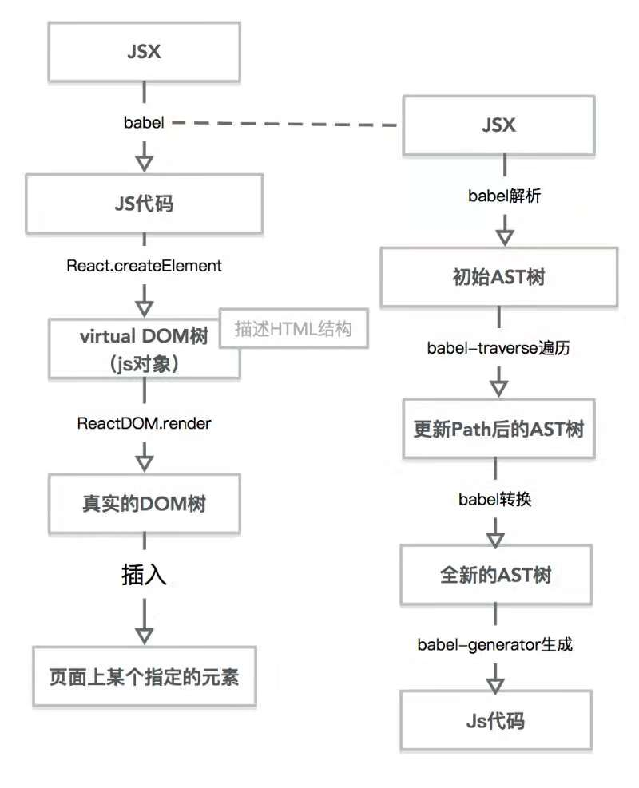

## JSX的原理

JSX是facebook出的标记语言， 是对JS语法的扩展，让JS支持类似HTML标签结构的语法。在编译过程中会把类似HTML的JSX结构转换成js对象结构。

jsx渲染流程图：

### 为什么 JSX 中的组件名要以大写字母开头?
JSX用大小写区分HTML标签和react组件

### 为什么一定要引用过react
因为在编译过程中一定会调用React.createElement来生成虚拟dom树

