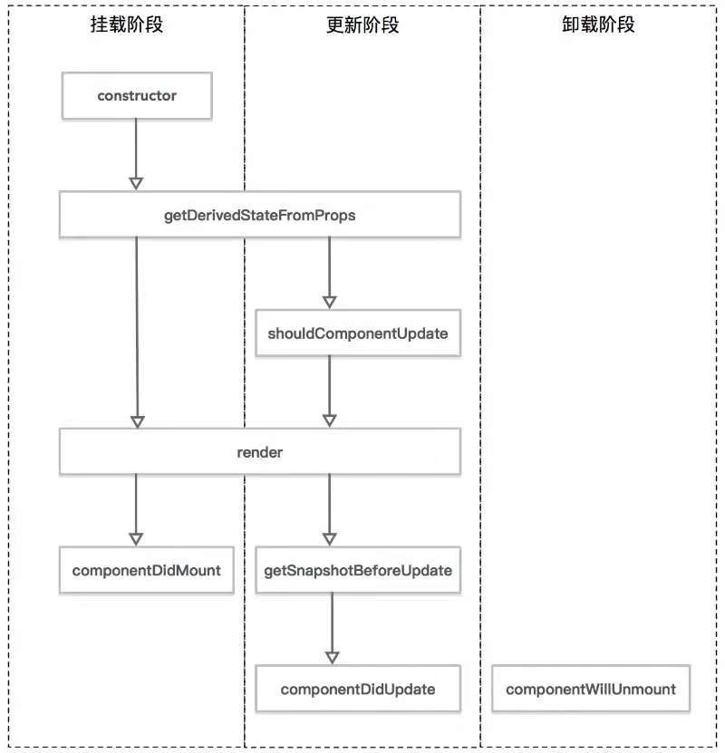

## React生命周期

- 挂载阶段： 讲组件插入到真实的dom中去，只执行一次
    - constructor
    - getDerivedStateFromProps
    - render
    - componentDidMount

- 更新阶段
    - getDerivedStateFromProps
    - shouldComponentUpdate
    - render
    - getSnapshotBeforeUpdate
    - componentDidUpdate

- 卸载阶段
    - compontWillUnmount

### 为什么请求数据一定要在componentDidMount
加载数据并挂载在组件上，只有等组件已经挂载到真实的网页上才能做。

componentDidMount方法是载组件已经完全挂载到网页上才会被调用执行，所以可以保证数据的加载。此时调用setState，会触发重新渲染。

constructor是被调用组件准备挂载的第一步，所以不合适。

### 状态提升
多个自组建的状态提升到父组件统一管理，通过props下发到各个子组件。

### 如何避免组件重新挂载，数据重新获取
将数据层和ui层分开，、只重新挂载UI层
